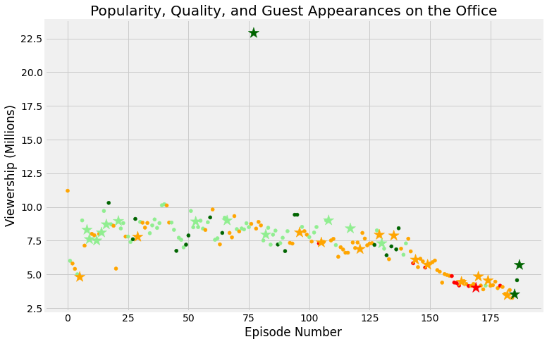

## 1. Welcome!
<p>.</p>
<p><strong>The Office!</strong> What started as a British mockumentary series about office culture in 2001 has since spawned ten other variants across the world, including an Israeli version (2010-13), a Hindi version (2019-), and even a French Canadian variant (2006-2007). Of all these iterations (including the original), the American series has been the longest-running, spanning 201 episodes over nine seasons.</p>
<p>In this notebook, we will take a look at a dataset of The Office episodes, and try to understand how the popularity and quality of the series varied over time. To do so, we will use the following dataset: <code>datasets/office_episodes.csv</code>, which was downloaded from Kaggle <a href="https://www.kaggle.com/nehaprabhavalkar/the-office-dataset">here</a>.</p>
<p>This dataset contains information on a variety of characteristics of each episode. In detail, these are:
<br></p>
<div style="background-color: #efebe4; color: #05192d; text-align:left; vertical-align: middle; padding: 15px 25px 15px 25px; line-height: 1.6;">
    <div style="font-size:20px"><b>datasets/office_episodes.csv</b></div>
<ul>
    <li><b>episode_number:</b> Canonical episode number.</li>
    <li><b>season:</b> Season in which the episode appeared.</li>
    <li><b>episode_title:</b> Title of the episode.</li>
    <li><b>description:</b> Description of the episode.</li>
    <li><b>ratings:</b> Average IMDB rating.</li>
    <li><b>votes:</b> Number of votes.</li>
    <li><b>viewership_mil:</b> Number of US viewers in millions.</li>
    <li><b>duration:</b> Duration in number of minutes.</li>
    <li><b>release_date:</b> Airdate.</li>
    <li><b>guest_stars:</b> Guest stars in the episode (if any).</li>
    <li><b>director:</b> Director of the episode.</li>
    <li><b>writers:</b> Writers of the episode.</li>
    <li><b>has_guests:</b> True/False column for whether the episode contained guest stars.</li>
    <li><b>scaled_ratings:</b> The ratings scaled from 0 (worst-reviewed) to 1 (best-reviewed).</li>
</ul>
    </div>


```python
# Use this cell to begin your analysis, and add as many as you would like!
#import pandas and matplotlib
#Read CSV file
import pandas as pd
import matplotlib.pyplot as plt

plt.rcParams['figure.figsize'] = [11, 7]
office_df = pd.read_csv('datasets/office_episodes.csv',parse_dates=["release_date"])
office_df.info()
```

    <class 'pandas.core.frame.DataFrame'>
    RangeIndex: 188 entries, 0 to 187
    Data columns (total 14 columns):
     #   Column          Non-Null Count  Dtype         
    ---  ------          --------------  -----         
     0   episode_number  188 non-null    int64         
     1   season          188 non-null    int64         
     2   episode_title   188 non-null    object        
     3   description     188 non-null    object        
     4   ratings         188 non-null    float64       
     5   votes           188 non-null    int64         
     6   viewership_mil  188 non-null    float64       
     7   duration        188 non-null    int64         
     8   release_date    188 non-null    datetime64[ns]
     9   guest_stars     29 non-null     object        
     10  director        188 non-null    object        
     11  writers         188 non-null    object        
     12  has_guests      188 non-null    bool          
     13  scaled_ratings  188 non-null    float64       
    dtypes: bool(1), datetime64[ns](1), float64(3), int64(4), object(5)
    memory usage: 19.4+ KB


```python
#Create Scatter Plot in Beginning Before Any Thing
fig = plt.figure() 

plt.scatter(x=office_df['episode_number'],y=office_df['viewership_mil'])
plt.show()
```


```python
#Make Column list to Scaled_rating
cols =[]

for ind, row in office_df.iterrows():
    if row['scaled_ratings'] < 0.25:
        cols.append('red')
    elif row['scaled_ratings'] < 0.50:
        cols.append('orange')
    elif row['scaled_ratings'] < 0.75:
        cols.append('lightgreen')
    else:
        cols.append('darkgreen')
cols[:20]
```


    ['orange',
     'lightgreen',
     'orange',
     'orange',
     'lightgreen',
     'orange',
     'lightgreen',
     'orange',
     'lightgreen',
     'lightgreen',
     'orange',
     'orange',
     'lightgreen',
     'orange',
     'lightgreen',
     'lightgreen',
     'lightgreen',
     'darkgreen',
     'lightgreen',
     'orange']


```python
#Knowing Size of Guest 
size = []

for ind, row in office_df.iterrows():
    if row['has_guests'] == False:
        size.append(25)
    else:
        size.append(250)
size
```


    [25,
     25,
     25,
     25,
     25,
     250,
     25,
     25,
     250,
     250,
     25,
     25,
     250,
     25,
     250,
     25,
     250,
     25,
     25,
     25,
     25,
     250,
     25,
     25,
     25,
     25,
     25,
     25,
     25,
     250,
     25,
     25,
     25,
     25,
     25,
     25,
     25,
     25,
     25,
     25,
     25,
     25,
     25,
     25,
     25,
     25,
     25,
     25,
     25,
     25,
     25,
     25,
     25,
     250,
     25,
     25,
     25,
     25,
     25,
     25,
     25,
     25,
     25,
     25,
     25,
     25,
     250,
     25,
     25,
     25,
     25,
     25,
     25,
     25,
     25,
     25,
     25,
     250,
     25,
     25,
     25,
     25,
     250,
     25,
     25,
     25,
     25,
     25,
     25,
     25,
     25,
     25,
     25,
     25,
     25,
     25,
     250,
     25,
     25,
     25,
     25,
     25,
     25,
     25,
     25,
     250,
     25,
     25,
     250,
     25,
     25,
     25,
     25,
     25,
     25,
     25,
     25,
     250,
     25,
     25,
     25,
     250,
     25,
     25,
     25,
     25,
     25,
     25,
     25,
     250,
     250,
     25,
     25,
     25,
     25,
     250,
     25,
     25,
     25,
     25,
     25,
     25,
     25,
     25,
     250,
     25,
     25,
     25,
     25,
     250,
     25,
     25,
     25,
     25,
     25,
     25,
     25,
     25,
     25,
     25,
     25,
     25,
     25,
     250,
     25,
     25,
     25,
     25,
     25,
     250,
     250,
     25,
     25,
     25,
     250,
     25,
     25,
     25,
     25,
     25,
     25,
     25,
     250,
     25,
     25,
     250,
     25,
     250]


```python
office_df['colors']=cols
office_df['sizes']=size

office_df.info()
```

    <class 'pandas.core.frame.DataFrame'>
    RangeIndex: 188 entries, 0 to 187
    Data columns (total 16 columns):
     #   Column          Non-Null Count  Dtype         
    ---  ------          --------------  -----         
     0   episode_number  188 non-null    int64         
     1   season          188 non-null    int64         
     2   episode_title   188 non-null    object        
     3   description     188 non-null    object        
     4   ratings         188 non-null    float64       
     5   votes           188 non-null    int64         
     6   viewership_mil  188 non-null    float64       
     7   duration        188 non-null    int64         
     8   release_date    188 non-null    datetime64[ns]
     9   guest_stars     29 non-null     object        
     10  director        188 non-null    object        
     11  writers         188 non-null    object        
     12  has_guests      188 non-null    bool          
     13  scaled_ratings  188 non-null    float64       
     14  colors          188 non-null    object        
     15  sizes           188 non-null    int64         
    dtypes: bool(1), datetime64[ns](1), float64(3), int64(5), object(6)
    memory usage: 22.3+ KB


```python
#Add Col and size to Scatter plot
fig = plt.figure() 

plt.scatter(x=office_df['episode_number'],
            y=office_df['viewership_mil'],
            c=cols,
            s=size
            
           )
plt.show()

```


```python
#put title,xlabel,ylabel to Scatter plot
fig = plt.figure() 

plt.scatter(x=office_df['episode_number'],
            y=office_df['viewership_mil'],
            c=cols,
            s=size
            )
plt.title("Popularity, Quality, and Guest Appearances on the Office")
plt.xlabel("Episode Number")
plt.ylabel("Viewership (Millions)")
plt.show()
```


```python
non_guest_df= office_df[office_df['has_guests']==False]
guest_df= office_df[office_df['has_guests']==True]
```


```python
#Make A classfication to non_guest and guest 
fig = plt.figure() 
plt.style.use('fivethirtyeight')

plt.scatter(x=non_guest_df['episode_number'],
            y=non_guest_df['viewership_mil'],
            c=non_guest_df['colors'],
            s=non_guest_df['sizes']
            )
plt.scatter(x=guest_df['episode_number'],
            y=guest_df['viewership_mil'],
            c=guest_df['colors'],
            s=guest_df['sizes'],
            marker='*'
            )
plt.title("Popularity, Quality, and Guest Appearances on the Office")
plt.xlabel("Episode Number")
plt.ylabel("Viewership (Millions)")
plt.show()
```





```python
#Put a condition to get top star
office_df[office_df['viewership_mil'] == office_df['viewership_mil'].max()]['guest_stars']
```


    77    Cloris Leachman, Jack Black, Jessica Alba
    Name: guest_stars, dtype: object


```python
#Get Name of top star
top_star = "Cloris Leachman"
```


```python
%%nose
import pandas as pd
import numpy as np

color_data = np.genfromtxt('datasets/color_data.csv', delimiter=',')
bonus_color_data = np.genfromtxt('datasets/bonus_color_data.csv', delimiter=',')
bonus_color_data_2 = np.genfromtxt('datasets/bonus_color_data_2.csv', delimiter=',')
solution_data = pd.read_csv('datasets/solution_data.csv')

x_axis_data = solution_data['x_axis'].values
y_axis_data = solution_data['y_axis'].values
size_data = solution_data['sizes'].values


# Try to retrieve student plot data, if it's been specified, otherwise set test values to null
try:
    # Generate x and y axis containers
    stu_yaxis_cont = []
    stu_xaxis_cont = []
    stu_sizes_cont = []
    stu_colors_cont = []

    # Loop through every axis in student's figure and grab x and y data
    for col in fig.gca().collections:
        stu_yaxis_cont.append(col._offsets.data[:,1])
        stu_xaxis_cont.append(col._offsets.data[:,0])
        stu_sizes_cont.append(np.full((1, len(col._offsets.data[:,0])), col._sizes)[0])
        stu_colors_cont.append(col._facecolors)

    # Get figure labels
    title = fig.gca()._axes.get_title()
    x_label = fig.gca()._axes.get_xlabel()
    y_label = fig.gca()._axes.get_ylabel()

    # Concatenate lists to compare to test plot
    stu_yaxis = np.concatenate(stu_yaxis_cont)
    stu_xaxis = np.concatenate(stu_xaxis_cont)
    stu_sizes = np.concatenate(stu_sizes_cont)
    stu_colors = np.concatenate(stu_colors_cont)
except:
    title = 'null'
    x_label = 'null'
    y_label = 'null'
    stu_yaxis = 'null'
    stu_xaxis = 'null'
    stu_sizes = [0, 1]
    stu_colors = [0, 1]

# Tests
def test_fig_exists():
    import matplotlib
    # Extra function to test for existence of fig to allow custom feedback
    def test_fig():
        try:
            fig
            return True
        except:
            return False
    assert (test_fig() == True), \
    'Did you correctly initalize a `fig` object using `fig = plt.figure()`?'
    assert (type(fig) == matplotlib.figure.Figure), \
    'Did you correctly initalize a `fig` object using `fig = plt.figure()`?'

def test_y_axis():
    assert (sorted(stu_yaxis) == y_axis_data).all(), \
    'Are you correctly plotting viwership in millions on the y axis? Make sure you are calling your plot in the same cell that you initialize `fig`!'
    
def test_x_axis():
    assert (sorted(stu_xaxis) == x_axis_data).all(), \
    'Are you correctly plotting episode number on the x axis? Make sure you are calling your plot in the same cell that you initialize `fig`!'
    
def test_colors():
    assert (len(stu_colors) == len(color_data)), \
    'Are you correctly setting the colors according to the rating scheme provided? Make sure you are calling your plot in the same cell that you initialize `fig`!'
    assert (np.sort(color_data) == np.sort(stu_colors)).all() or \
    (np.sort(bonus_color_data) == np.sort(stu_colors)).all() or \
    (np.sort(bonus_color_data_2) == np.sort(stu_colors)).all(), \
    'Are you correctly setting the colors according to the rating scheme provided? Make sure you are calling your plot in the same cell that you initialize `fig`!'

def test_size():
    assert (len(stu_sizes) == len(size_data)), \
    'Are you correctly plotting all points as size 25, except for guest-star episodes which are sized at 250? Make sure you are calling your plot in the same cell that you initialize `fig`!'
    assert all(size_data == np.sort(stu_sizes)), \
    'Are you correctly plotting all points as size 25, except for guest-star episodes which are sized at 250? Make sure you are calling your plot in the same cell that you initialize `fig`!'

def test_labels():
    assert (title.lower() == ('Popularity, Quality, and Guest Appearances on the Office').lower()), \
    'Did you set the correct title? Make sure you are specifying your plot in the same cell that you initialize `fig`!'
    assert (x_label.lower() == ('Episode Number').lower()), \
    'Did you set the correct x label? Make sure you are specifying your plot in the same cell that you initialize `fig`!'
    assert (y_label.lower() == ('Viewership (Millions)').lower()), \
    'Did you set the correct x label? Make sure you are specifying your plot in the same cell that you initialize `fig`!' 

def test_stars():
    assert (top_star == 'Cloris Leachman' or top_star == 'Jack Black' or top_star == 'Jessica Alba'), \
    "Are you correctly assigning one of the guest stars of the most popular episode to `top_star`?"
```


    7/7 tests passed


